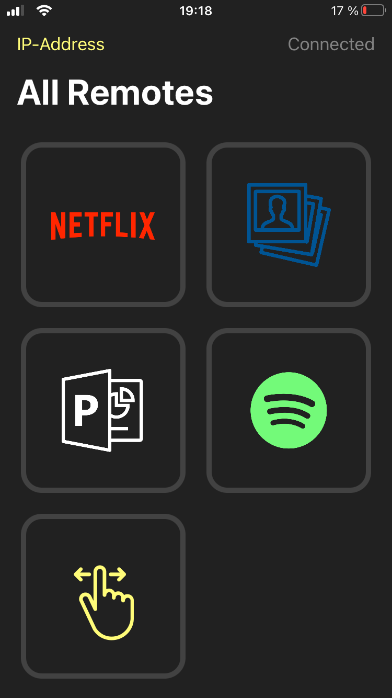

# MacRemote

This iOS-App allows to control some apps on a mac remotely via the iPhone. As a communication protocol TCP is used. 

### Preview

<div align="center">
  
  
  
  
</div>

### Controllable Apps are

* Netflix (pause/play)
* Photos App (select images, present images, show next/previous image)
* PowerPoint (start/end presentation, next/previous slide)
* Spotify (pause/play, play next/previous song)
* Desktop (switch between different Desktops)

### Compatibility

The App was developed for and tested on an iPhone 6s with iOS 12. However, later iOS versions (including iOS 14) and different iPhones newer than iPhone 6s work as well. 

## How to use

The MacRemote consists of two parts: The Java App and the iOS App. 

### Java App

First compile the Java App:

```bash
cd $PWD/macRemoteServer
javac MacRemoteServer.java
```

and then run it:

```bash
java MacRemoteServer
```

### iOS App

Open the project in XCode, connect your iPhone to your Mac and simply run the App on your iPhone. You might have to trust the developer in `Settings -> General -> Profiles & Device Management`. 

Open the App on your iPhone and press IP-Address. Now you have to type in the IP-Address of your Home-Network. You can find it on your Mac under `System Preferences -> Network`. Press `Connect`. Now everything should be up and running and the App sould display `Connected` in the upper right corner. 

**Note:** To use the remote control the desired App needs to be focused on your Mac.
