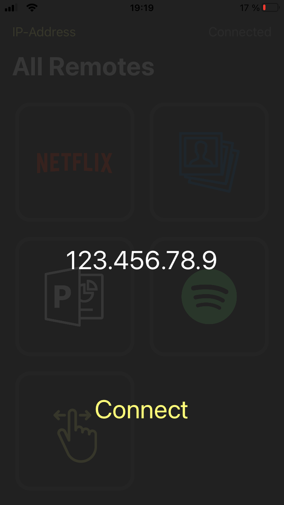

# macRemote

This iOS-App allows to control some apps on a mac remotely via the iPhone. As a communication protocol TCP is used. 

### Preview

  
  
  
  

### Controllable Apps are
* Netflix (pause/play)
* Photos App (select images, present images, show next/previous image)
* PowerPoint (start/end presentation, next/previous slide)
* Spotify (pause/play, play next/previous song)
* Desktop (switch between different Desktops)

## How to use

